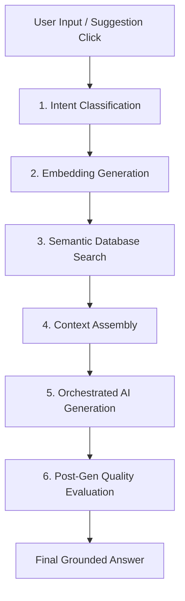

# Mindstream: Glass Box RAG Pipeline Architecture

This document provides a highly detailed, end-to-end technical overview of the **Retrieval-Augmented Generation (RAG) Architecture** powering the Mindstream conversational assistant. The "Glass Box AI" interface is designed to demystify AI actions by rendering every step of this pipeline in real-time, giving users complete transparency over how their personal journal entries, habits, and goals are utilized to construct responses.

---

## 1. System Overview & Core Philosophy

Rather than replying with generic training weights, Mindstream uses an **Adaptive RAG Engine** to ground all responses securely in the user's private dataset. This architecture is designed around four strict constraints:
1. **Security & Privacy**: User data never leaves the client or secure database unencrypted. All AI invocations are proxied through secure Supabase Deno Edge Functions to keep raw LLM API keys hidden from client-side inspectors.
2. **Relevance & Contextual Awareness**: Queries are classified to determine if they target behavioral trends, specific timeframes, or semantic topics, adjusting database queries accordingly.
3. **Transparency (Glass Box)**: Every phase of the execution—intent categorization, vector search scores, token budget weights, model selection, and post-generation quality metrics—is exposed visually.
4. **Validation (Self-Evaluation)**: Responses are rated by a secondary evaluator to verify that no hallucinations occurred and that the output is faithful to the retrieved dataset.

---

## 2. The End-to-End RAG Lifecycle

When a user submits a query (or clicks an interactive suggestion card), the system executes a 6-stage pipeline.



### Stage 1: Query Intent Classification
The incoming query text and the active conversation history (capped at the last **2 messages** to avoid history-bias drift) are sent to the `ai-proxy` edge function. A classification prompt evaluates the query against specialized pre-checks and a decision tree:

*   **Pre-Check Rules**:
    1.  *Pronoun/Temporal Lookup Check*: Queries containing patterns like `"when did I"`, `"when was I"`, or `"when did I last"` are hardcoded to skip temporal analysis and route straight to `SEMANTIC_TOPIC`.
    2.  *Tracking/Streak Check*: Queries containing keywords like `"streak"`, `"consistency"`, `"completion rate"`, or `"consistent"` are routed immediately to `BEHAVIORAL`.
    3.  *Habit Timeline Check*: Queries matching `"habit"` or an activity name alongside a time reference (e.g. `"last 2 weeks"`) route to `TEMPORAL_TOPIC`.
*   **Decision Tree Intent Classes**:
    *   `TEMPORAL_SUMMARY`: Generic overview of a time frame (e.g., *"What happened this week?"*).
    *   `TEMPORAL_TOPIC`: Specific activity/emotion within a time frame (e.g., *"How has my anxiety been this week?"*).
    *   `SEMANTIC_TOPIC`: Keyword lookup or memory retrieval with no explicit time window (e.g., *"Tell me about my running"*).
    *   `BEHAVIORAL`: Streak progress, habit completions, and goal completions (e.g., *"Am I hitting my goals?"*).
    *   `ANALYTICAL`: Overall trend and correlation patterns.
    *   `CONVERSATIONAL`: Acknowledgements, follow-ups, or questions relying purely on chat history (e.g., *"Tell me more"*, *"What do you mean?"*).

The model returns a JSON payload containing the parsed intent, confirmation of temporal bounds, a structured `temporalExpression` string, and a list of target `topicKeywords`.

---

### Stage 2: Embedding Generation
If the classified intent is not purely conversational, the system generates a vector representation of the query to search database logs:
*   The query text is sent to the Supabase Vector Edge function.
*   It computes a **384-dimensional vector embedding** using the `gte-small` model.
*   This embedding captures the underlying semantic meaning of the user's question, allowing matches even if the user uses synonyms or different wording from their journal entries.

---

### Stage 3: Semantic Database Search
Using the computed embedding, Mindstream queries the PostgreSQL database via pgvector:
*   **Cosine Similarity Matching**: The database compares the query embedding against the stored vector embeddings in the `entries` table using cosine similarity:
    $$\text{Similarity} = \frac{A \cdot B}{\|A\| \|B\|}$$
*   **Temporal Filters**: If the classifier flagged `hasTemporalIntent` as `true` (e.g. *"last 30 days"*), the dates are parsed (e.g. `startDate`, `endDate`), and a `timestamp` filter is appended to the SQL query to isolate entries written within that specific range.
*   **Keyword Fallback**: If vector database retrieval yields zero matches, the system dynamically switches to keyword matching (ILIKE text queries) to ensure relevant entries are still captured.
*   **Result Set**: The top **3 entries** with similarity scores above the threshold (default: 0.82) are fetched.

---

### Stage 4: Context Assembly (Token Budgeting)
Mindstream gathers different dimensions of the user's sandbox state to assemble the final system prompt:
1.  **Retrieved Journal Chunks**: The matching entries fetched during Semantic Search.
2.  **Recent Context**: A count of recent journals to provide general ambient awareness.
3.  **Habit Matrix**: Streaks, category metadata, and daily completion logs for the user's active habits.
4.  **Intentions & Goals**: Pending and starred goals/milestones.

*   **Token Budget Division**:
    These components are structured into distinct partitions, visualized in the Glass Box via a color-coded stacked bar:
    *   `System Prompt` (Gray): Instructions, personality rules (e.g., Stoic, Empathetic), and conversational constraints.
    *   `Context Assembly` (Teal): Retrieved journal entries, streaks, and goal state metadata.
    *   `History` (Blue): Pinned chat history turns.
    *   `User Message` (Purple): The current query.
    *   *Metric*: The **Output Ratio** is displayed with a hover warning (`title`), clarifying that low output ratios (~2%) are expected behavior because RAG inputs (embedding chunks + tabular logs) are heavy by design.

---

### Stage 5: Orchestrated AI Generation
The assembled prompt is submitted to the Edge Function orchestration handler. The system uses a **Fallback Provider Chain** to guarantee high availability:
1.  **Orchestrator Model (Groq 70B)**: `llama-3.3-70b-versatile`. Synthesizes the final context into a grounded, personalized answer.
2.  **Backup Models**: If rate limits, network timeouts, or edge gateway errors are encountered, the proxy automatically falls back in order to:
    -   `Groq 8B` (`llama-3.1-8b-instant`)
    -   `Gemini Flash` (`gemini-2.0-flash`)
    -   `Gemini Lite` (`gemini-2.5-flash-lite`)
3.  **Edge JSON Filtering**: If a rate-limit caching layer leaks raw JSON, a utility method (`unwrapResponse`) sanitizes the text payload, rendering clean, plain copy in the bubble.

---

### Stage 6: Post-Generation Quality Evaluation (RAGAS)
To guarantee validation and trust, a secondary LLM evaluator runs a post-generation audit on the output. It returns four RAGAS-inspired scores (scaled 0-100) and a qualitative summary:

1.  **Faithfulness**: Measures if the generated response is strictly grounded in the retrieved database chunks. High scores confirm zero hallucinations.
2.  **Answer Relevancy**: Verifies that the AI directly answered the user's query without deviating.
3.  **Context Precision**: Evaluates if the retrieved database entries were actually relevant to the user's topic.
4.  **Context Recall**: Audits if all facts mentioned in the generated response correspond to the retrieved chunks.
5.  **F-Score**: The harmonic mean of Faithfulness and Answer Relevancy:
    $$F\text{-Score} = 2 \times \frac{\text{Faithfulness} \times \text{Relevancy}}{\text{Faithfulness} + \text{Relevancy}}$$

*   **Conversational Exception Note**:
    For conversational turns (e.g. *"tell me more"*, *"interesting"*), retrieved entries are not utilized. Therefore, the F-score displays a muted inline annotation explaining that low scores on these turns are expected by design because RAGAS measures grounding against retrieved context chunks, not conversational history.

---

## 3. Data Flow Diagram

```
[Client App] 
     │
     ▼ (Secure HTTPS Invoke)
[Supabase Edge Functions (ai-proxy)]
     │
     ├─► [Supabase Vector DB (PostgreSQL pgvector)] ──► Cosine Similarity Match
     │
     ├─► [Groq API / Gemini API] ──► Fallback Provider Chain
     │
     └─► [Self-Evaluator LLM] ──► RAGAS Quality Scores
```

---

## 4. Key Security & Privacy Safeguards
*   **Hidden Credentials**: All LLM API keys (Groq, Google GenAI) are stored as encrypted environment variables in Supabase and never exposed to client bundles.
*   **System Tag Filtering**: Automated welcome messages, instructions, or developer diagnostics logs are excluded from semantic retrieval to prevent system prompts from polluting user answers.
*   **Anonymized Demo Data**: Demo Sandbox sessions use temporary PostgreSQL records seeded via Edge Functions. These are automatically garbage-collected after the session terminates, ensuring zero data leakage.

---

## Appendix: Demo Sandbox Sample Dataset Templates

The following table contains the 28 realistic pre-filled journal entries generated during Demo Sandbox initialization:

| # | Title | Emotion | Emoji | Tags | Journal Content |
|---|---|---|---|---|---|
| 1 | Golden Morning Run | Joyful | 🌅 | running, nature, morning | Woke up early and went for a run along the river. The sunrise was incredible today — golden light on the water. Felt so alive. |
| 2 | Deadline Push | Overwhelmed | 💼 | work, stress, productivity | Work was intense today. Back-to-back meetings and a tight deadline for the Q1 report. Managed to push through but felt drained by 5pm. |
| 3 | Stories from Mom | Grateful | ❤️ | family, gratitude, connection | Had a great conversation with Mom today. She told me stories about her childhood I'd never heard before. Feeling grateful for family. |
| 4 | Restless Night | Anxious | 🌙 | sleep, anxiety, presentation | Couldn't sleep last night. Mind racing about the presentation tomorrow. Tried meditation but kept getting distracted. Need to work on this. |
| 5 | Atomic Habits Complete | Hopeful | 📚 | reading, habits, growth | Finished reading 'Atomic Habits'. The idea of habit stacking really resonated with me. Going to try pairing meditation with my morning coffee. |
| 6 | Rest Day | Content | ☁️ | rest, self-care, reflection | Skipped my jog today and spent the morning journaling instead. Sometimes rest IS productive. My body needed it. |
| 7 | Presentation Win | Proud | 🎉 | work, success, celebration | The team loved my presentation! Got great feedback from the VP. All that prep paid off. Celebrating with dinner out tonight. |
| 8 | Breaking the Routine | Frustrated | 🔄 | routine, boredom, change | Feeling stuck in a rut. Same routine, same commute, same meals. Need to shake things up but not sure how. |
| 9 | Yoga Discovery | Content | 🧘 | yoga, mindfulness, new experience | Tried a new yoga class at the studio downtown. The instructor was amazing — first time I've felt truly present in weeks. |
| 10 | Argument Reflection | Sad | 😔 | relationships, conflict, self-awareness | Had an argument with Jake about something stupid. I know I overreacted. Need to apologize tomorrow. Why do I get defensive so easily? |
| 11 | Kitchen Therapy | Content | 🍄 | cooking, self-care, mindfulness | Cooked a proper meal for the first time in weeks. Mushroom risotto from scratch. The act of cooking was therapeutic. |
| 12 | Streak Milestone | Proud | 🏃 | running, streak, progress | 12-day running streak! My pace is improving — 5:30/km average this week. The consistency is paying off. |
| 13 | Growth Feedback | Reflective | 📊 | work, feedback, growth | Quarterly review at work. Got positive feedback but also honest areas for improvement. Need to work on delegation. |
| 14 | Market Day | Content | 🥬 | food, nature, weekend | Spent the afternoon at the farmers market. Bought way too many vegetables. There's something grounding about choosing real food. |
| 15 | Clarity Moment | Hopeful | ✨ | meditation, career, clarity | Meditation session was deep today. 20 minutes felt like 5. Had a moment of clarity about the career change I've been considering. |
| 16 | Rainy Day Reading | Content | 🌧️ | reading, rain, focus | Rain all day. Stayed in and read. Finished half of 'Deep Work'. Cal Newport makes some compelling arguments about focus. |
| 17 | Birthday Celebration | Joyful | 🎂 | friends, celebration, social | Friend's birthday dinner. Great energy, good food, lots of laughing. Realized I need to prioritize social time more. |
| 18 | Anxiety Wave | Anxious | 🌊 | anxiety, meditation, coping | Anxiety spiked today for no clear reason. Heart racing, couldn't focus. Did a 10-minute body scan which helped bring me back. |
| 19 | Python Day 1 | Hopeful | 🐍 | coding, learning, career | Started learning Python for the ML course. The syntax is so clean compared to what I'm used to. Excited about this path. |
| 20 | Perfect Sunday | Content | ☕ | weekend, balance, peace | Perfect Sunday morning. Coffee on the balcony, birds singing, no agenda. This is what balance feels like. |
| 21 | Giving Back | Grateful | 🤝 | volunteering, community, gratitude | Volunteered at the food bank with the team. Hard work but incredibly rewarding. The coordinator said they served 200 families. |
| 22 | Cold Plunge Debut | Proud | 🧊 | cold plunge, energy, new experience | Tried cold plunge for the first time. 2 minutes felt like 20. But the energy after was unreal — clear headed for hours. |
| 23 | Low Energy Day | Frustrated | 😴 | low energy, motivation, walking | Mid-week slump. Low energy, no motivation. Forced myself to at least walk around the block. Small wins. |
| 24 | Mentor Wisdom | Reflective | 💡 | mentorship, career, wisdom | Great catch-up with my mentor over coffee. He reminded me that career growth isn't always linear. Needed to hear that. |
| 25 | Journaling Milestone | Proud | 📝 | journaling, streak, habit | Journaling streak: 24 days! The consistency of writing has changed how I process my day. It's become a non-negotiable. |
| 26 | Less Screen Time | Content | 📱 | screens, sleep, habits | Noticed I've been reaching for my phone less. The digital sunset habit is working. Sleep quality is noticeably better. |
| 27 | Signature Dish | Joyful | 👨‍🍳 | cooking, friends, hosting | Cooked for friends tonight. The risotto recipe is now my signature dish. Everyone asked for the recipe. |
| 28 | 5K Personal Record | Proud | 🏆 | running, PR, progress | Set a new PR on my morning run — 24:12 for 5K! All those early mornings are compounding. Feeling unstoppable. |

### Demo Sandbox Pre-filled Habits

| Habit Name | Emoji | Frequency | Category | Initial Current Streak | Initial Longest Streak |
|---|---|---|---|---|---|
| Morning Jog | 🏃 | daily | Health | 12 days | 21 days |
| Meditation | 🧘 | daily | Health | 8 days | 15 days |
| Reading | 📚 | daily | Growth | 3 days | 10 days |
| Drink 8 Glasses of Water | 💧 | daily | Health | 5 days | 14 days |
| No Screens After 10PM | 📵 | daily | Health | 2 days | 7 days |

### Demo Sandbox Pre-filled Goals (Intentions)

| Goal / Intention Text | Emoji | Category | Life Goal? | Starred? | Status |
|---|---|---|---|---|---|
| Run a half marathon by June | 🏅 | Health | No | Yes | Pending |
| Read 12 books this year | 📖 | Growth | No | No | Pending |
| Practice gratitude daily | 🙏 | Health | Yes | No | Pending |
| Complete online ML course | 🤖 | Career | No | Yes | Pending |
