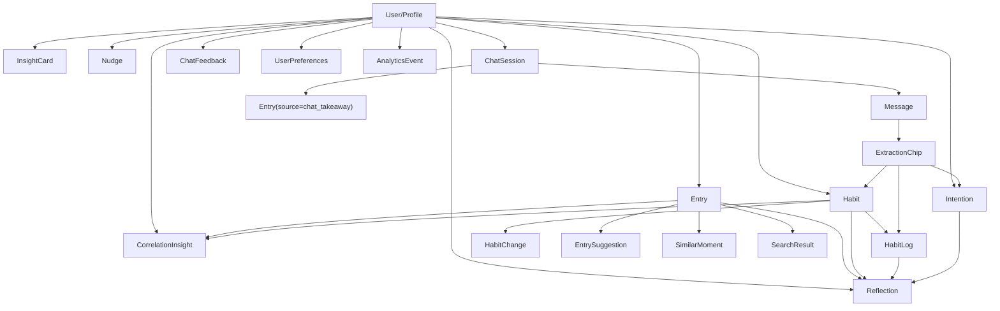
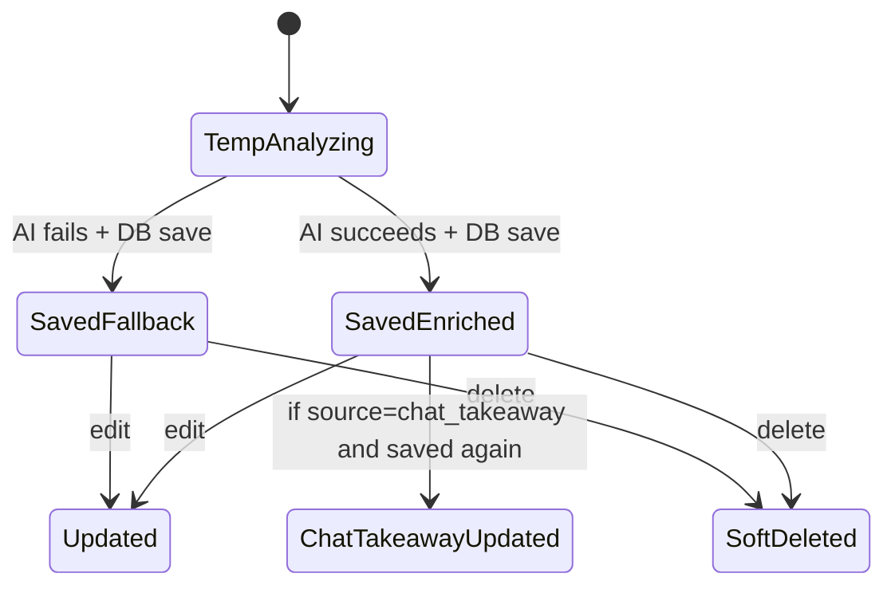
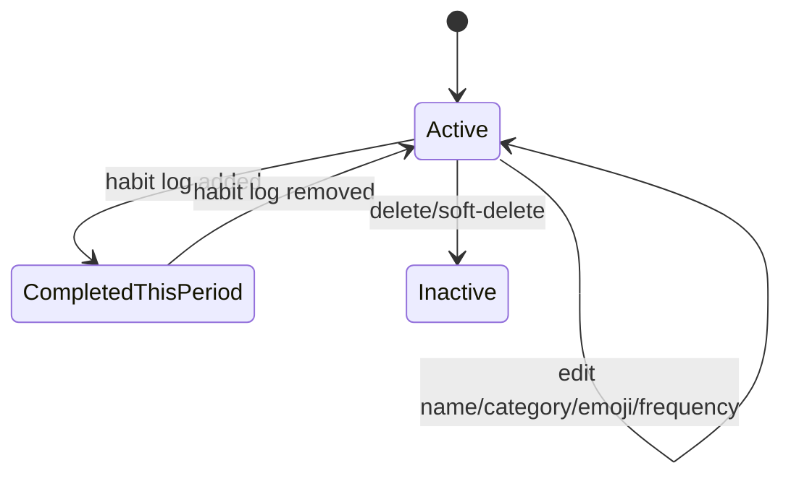
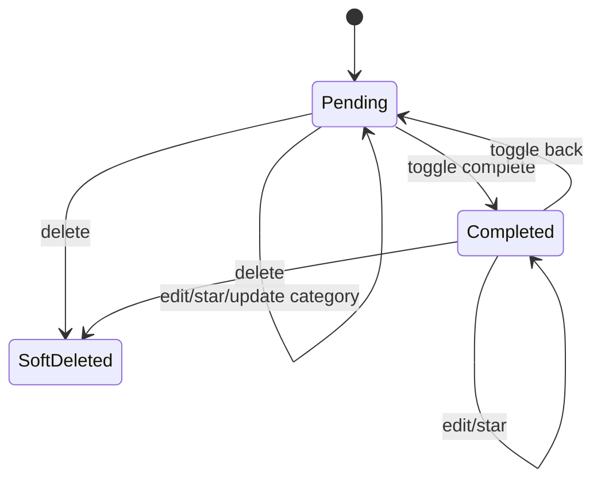
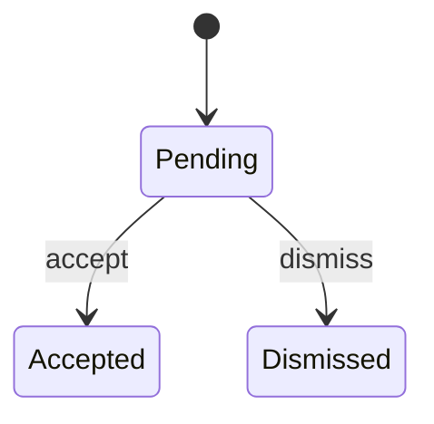
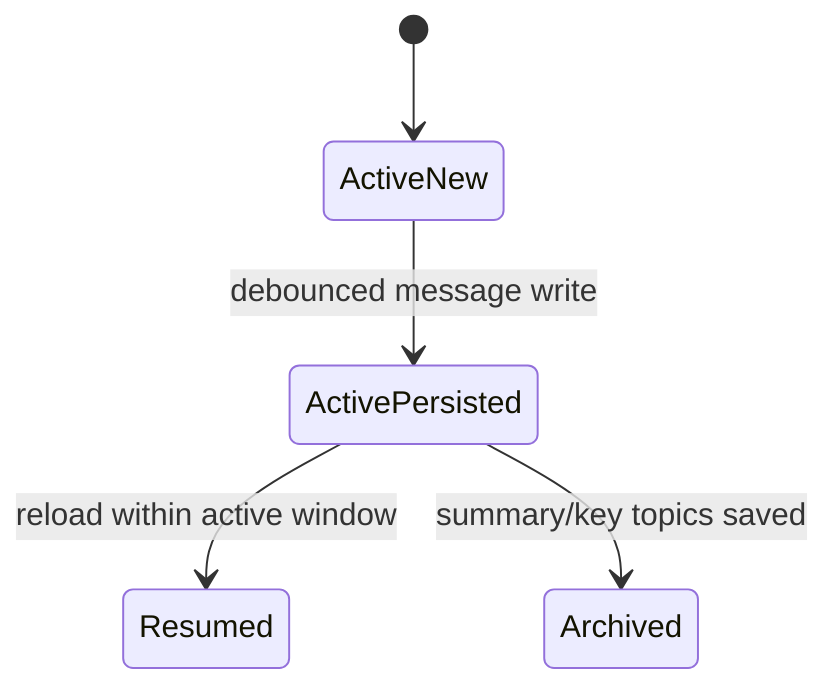
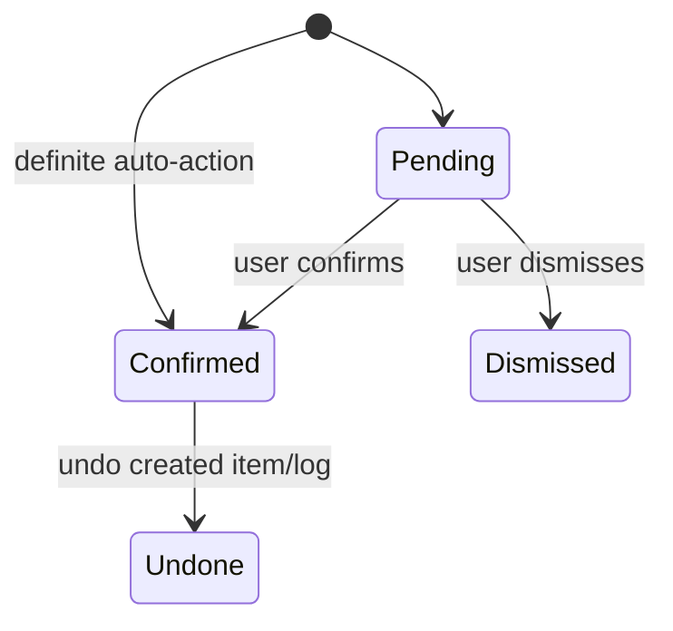
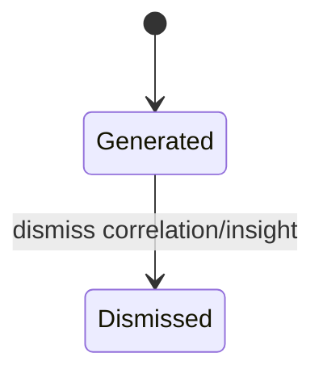

Phase 3 complete. This is the runtime conceptual model, based on shared types, active state, reachable screens, persistence functions, and table boundaries. No AI prompts inspected.

**Domain Model**
Mindstream’s runtime model centers on a `User/Profile` who owns a private personal dataset.

Core entities:

- `Profile`: user identity, onboarding state, demo state, account age, stored memory fields.
- `Entry`: journal/thought record. Can be manual, voice-created, or AI-generated chat takeaway.
- `Habit`: recurring behavior system.
- `HabitLog`: completion marker for a habit in a daily/weekly/monthly period.
- `Intention`: goal/task/life goal with status, due date, priority, category, and emoji.
- `Reflection`: AI-generated synthesis over entries/habits/intentions for daily/weekly/monthly periods.
- `InsightCard`: AI-generated insight card, currently persisted but not actively rendered in Stream.
- `Nudge`: AI/background-generated intervention with pending/accepted/dismissed lifecycle, currently persisted but not actively rendered.
- `CorrelationInsight`: weekly derived pattern connecting entries and habits.
- `Message`: chat message, stored inside chat sessions.
- `ChatSession`: persistent conversational session with messages and optional archive summary.
- `ChatFeedback`: opt-in shared chat copy for quality review.
- `ExtractionChip`: transient or message-attached action proposal from chat, optionally creating a habit/goal/log.
- `UserPreferences`: AI personality and flags.
- `AnalyticsEvent`: behavioral event log.
- `OnboardingContext`: stored profile-level initial user context.
- `AIProfile`: stored profile-level derived memory summary.
- `SearchResult` and `SimilarMoment`: derived retrieval objects, not first-class user records.

**Entity Relationship Map**

**Ownership**
Runtime ownership is user-scoped.

- Directly user-owned: `Profile`, `Entry`, `Habit`, `Intention`, `Reflection`, `InsightCard`, `Nudge`, `CorrelationInsight`, `ChatSession`, `ChatFeedback`, `UserPreferences`, `AnalyticsEvent`.
- Indirectly user-owned: `HabitLog` through `Habit`; `HabitChange` through `Habit` plus `user_id`.
- Embedded/transient ownership: `Message` belongs to a `ChatSession`; `ExtractionChip` belongs to an AI message; `EntrySuggestion` belongs to an `Entry`.

**Creation Sources**
User-created:
- Entries from Stream input.
- Voice entries from SharedInputBar.
- Habits from Life input, Entry suggestions, or chat extraction.
- Intentions from Life Goals, task modal, Entry suggestions, or chat extraction.
- Habit logs from toggling habits.
- Chat messages from Chat input.
- Settings choices such as personality and chat sharing.

AI-generated:
- Entry enrichment: title, tags, sentiment, emoji.
- Entry suggestions.
- Guided onboarding instant insight.
- Reflections.
- Thematic reflection.
- Chat AI messages.
- Extraction chips.
- Habit emoji/category.
- Intention emoji/category.
- Chat takeaway summary/title.
- Correlation insight.
- AI profile.
- Nudges.
- Embeddings.

Derived:
- Current streak and longest streak.
- Dominant daily mood in Stream.
- Due-today task list.
- Weekly/monthly nudge items in Life header.
- Search results.
- Similar moments.
- User context for chat.
- Yearly review data, currently dormant from active navigation.

Transient runtime state:
- selected view
- selected tag
- modal open/close state
- pending entry/goal text before EntryTypeModal save
- pending first insight
- current chat loading state
- AI status banner state
- toast state
- Glass Box metadata
- local UI state such as expanded entry card, active Life subview, TTS enabled, sharing modal visible

**State Diagrams**
Entry:

Habit:

Intention:

Nudge:

Chat Session:

Extraction Chip:

Reflection / Correlation:

**Data Lifecycle**
Profile:
Created after auth. Regular users receive initial onboarding content. Demo users are seeded through the demo-data function. Profile persists account/onboarding/demo state and derived memory fields.

Entry:
Created optimistically in UI, enriched by AI if available, persisted to `entries`, then asynchronously receives embedding. Entries can be edited or soft-deleted. Chat takeaways are stored as entries with `source = chat_takeaway`.

Habit:
Created from Life input, entry suggestion, or chat extraction. Stored active by default. Completion creates/removes habit logs. Habit deletion marks inactive/deleted rather than removing from the conceptual model.

HabitLog:
Created or removed through habit toggles. It represents completion in a period, not a standalone user-authored object.

Intention:
Created from Life Goals/task flow, entry suggestion, onboarding/AI flow, or chat extraction. Starts `pending`; can become `completed`; can toggle back; can be starred, edited, or soft-deleted.

Reflection:
Generated from user data and stored by type/date. Conceptually depends on entries, habits, habit logs, and intentions.

Chat:
A user has an active chat session. Messages are stored as JSON inside `chat_sessions`. User messages trigger AI responses. Chat can produce extraction chips, feedback records, and takeaway entries.

ChatFeedback:
Created only when sharing is enabled. Updated as conversation continues. User can delete shared chats from Settings.

CorrelationInsight:
Generated in background weekly from entries/habits/logs. One per user/week. Can be dismissed.

Nudge:
Generated in background from patterns. Can be accepted or dismissed. Current active UI does not render Stream nudges, but lifecycle exists.

AnalyticsEvent:
Created throughout flows. Owned by user. Derived behavioral telemetry.

**Runtime Ownership Summary**
The product’s conceptual ownership rule is simple: the authenticated user owns the personal data graph. AI may enrich, classify, summarize, or derive from that graph, but the generated artifacts are still stored under the user. Transient UI state belongs to the session, not the durable domain.

todays date: 2026-07-03
latest commit id: 8a30b86a2b702c4790f42c9486f7e85b6d5a77eb
