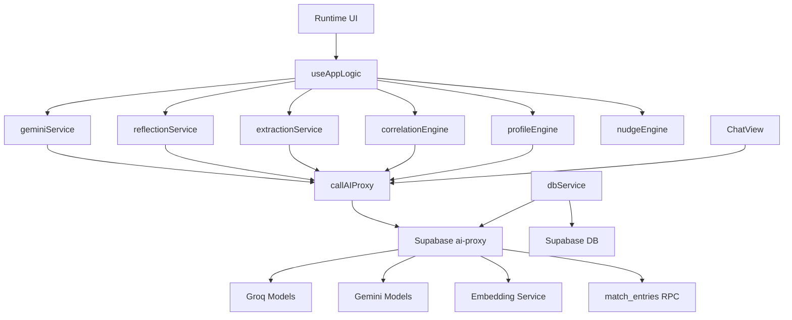
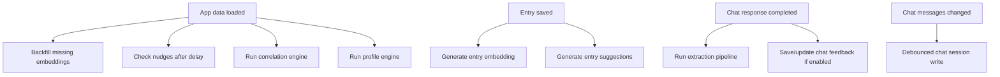
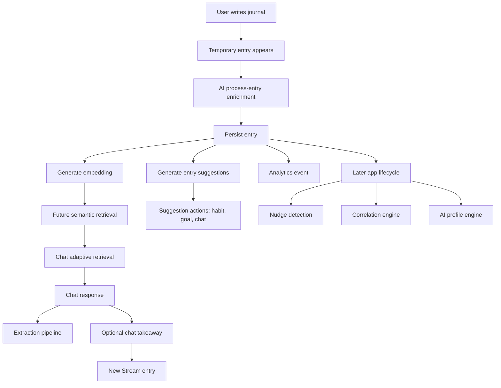

I updated the working Mindstream knowledge with the runtime AI architecture before mapping this phase.

Source of truth used: runtime wiring, service calls, state transitions, Edge Function actions, and persistence paths. I did not include or reveal prompt contents.

**AI Subsystem Map**
Mindstream’s AI system is centered on a Supabase Edge Function: `ai-proxy`.

Client-facing AI boundary:
- [services/geminiClient.ts](/Users/director/Desktop/Mindstream_v1/services/geminiClient.ts:107) exposes `callAIProxy(action, payload)`.
- It invokes Supabase Function `ai-proxy`.
- It captures provider/model metadata for Glass Box.
- It converts demo-limit responses into `DemoLimitError`.

Runtime model/provider layer:
- `ai-proxy` routes actions to Groq and Gemini providers.
- Default provider chain appears to be Groq 120B → Gemini Flash → Groq 20B.
- Lightweight/background actions use a cheaper/faster chain: Groq 20B → Gemini Lite → Gemini Flash.
- Embedding/search actions bypass normal auth/model flow differently than chat/generation actions.

Major AI action names observed:
- `process-entry`
- `suggestions`
- `chat`
- `chat-summary`
- `classify-behavior`
- `extract-behavior`
- `analyze-habit`
- `analyze-intention`
- `daily-reflection`
- `weekly-reflection`
- `monthly-reflection`
- `instant-insight`
- `detect-correlations`
- `build-ai-profile`
- `extract-keywords`
- `classify-intent`
- `generate-embedding`
- `semantic-search`

**Pipeline Map**
Journal Processing:
- Trigger: user submits Stream input.
- Input: raw text plus `viaVoice`.
- Context assembled: current user, AI status, current entry count for analytics.
- Retrieval: none before processing.
- Model/service: `process-entry` via `gemini.processEntry`.
- Post-processing: fallback defaults if AI fails; then optional suggestions.
- Persistence: entry saved to `entries`; embedding generated after insert.
- Background jobs: entry suggestions, embedding generation, later profile/correlation/nudge effects on app lifecycle.
- UI: temp “Analyzing…” entry replaced with saved entry.
- Failure: temp entry removed only if save fails; AI failure still saves as draft/fallback.

Entry Enrichment:
- Trigger: journal processing.
- Input: entry text.
- Context assembled: entry text only.
- Retrieval: none.
- Model/service: `ai-proxy: process-entry`.
- Post-processing: expected enriched fields become title, tags, emoji, sentiment.
- Persistence: enriched data stored with entry.
- UI: EntryCard shows title, emoji, sentiment, tags.
- Failure: defaults: generic title, `Unprocessed`, default emoji, null sentiment.

Entry Suggestions:
- Trigger: after entry save, if AI ready and text has enough words.
- Input: entry text.
- Context assembled: entry text.
- Retrieval: none.
- Model/service: `ai-proxy: suggestions`.
- Post-processing: empty/null suggestions allowed.
- Persistence: suggestions patched onto entry.
- UI: expanded EntryCard shows “Mindstream Suggests.”
- Failure: silent fallback to no suggestions.

Chat:
- Trigger: user submits Chat input.
- Input: current message, message history, optional seed.
- Context assembled: user profile, recent ambient context, adaptive retrieval results, session summaries, recent correlations, onboarding context, AI profile, profile identity.
- Retrieval: intent classification, query embedding, semantic search, temporal search, habit context, goal context, analytical context depending on classified intent.
- Model/service: `ai-proxy: chat`.
- Post-processing: streamed/simulated response assembled, response unwrapped if structured wrapper leaks.
- Persistence: messages stored in `chat_sessions` by `useChatSession`; optional `chat_feedback`.
- Background jobs: extraction pipeline after AI response; chat feedback update if sharing enabled.
- UI: user message appears, AI message fills, loading dots, Glass Box metadata updated.
- Failure: demo-limit modal for demo limit; otherwise AI error message appended.

Chat Takeaways:
- Trigger: user clicks Save Takeaway after threshold.
- Input: formatted conversation.
- Context assembled: chat transcript, message count, user word count.
- Retrieval: none.
- Model/service: `ai-proxy: chat-summary`.
- Post-processing: validates title and summary.
- Persistence: creates or updates `entries` with `source='chat_takeaway'`.
- UI: button loading state, success/error toast, Stream shows “From Chat” badge.
- Failure: logs failure event, shows “Failed to save.”

Chat Extraction:
- Trigger: after AI chat response, non-demo users only.
- Input: latest user message, recent messages, existing habits and intentions.
- Context assembled: existing habit/goal names for duplicate detection.
- Retrieval: none.
- Model/service: `classify-behavior`, then `extract-behavior` if classification passes.
- Post-processing: confidence gates, vague-label checks, duplicate checks, commitment-level normalization.
- Persistence: definite actions may auto-create habit, log habit, or create goal.
- UI: ExtractionChip attached to last AI message; user can confirm/undo.
- Failure: silent; chat response is never blocked.

Habit Generation:
- Trigger: Life input, entry suggestion, or chat extraction.
- Input: habit name and frequency.
- Context assembled: habit text.
- Retrieval: none.
- Model/service: `analyze-habit`.
- Post-processing: emoji/category selected, with defaults on failure.
- Persistence: `habits`; completion creates/removes `habit_logs`.
- UI: habit appears in Life grid/detail.
- Failure: habit still created with default emoji/category.

Intention Generation:
- Trigger: Life Goals input, task modal, entry suggestion, or chat extraction.
- Input: goal text, due date, life-goal flag.
- Context assembled: intention text.
- Retrieval: none.
- Model/service: async `analyze-intention`.
- Post-processing: defaults first, later AI emoji/category update.
- Persistence: `intentions`.
- UI: optimistic temp goal replaced by saved goal; later emoji/category may update.
- Failure: save failure removes temp; AI enrichment failure leaves defaults.

Reflection Generation:
- Trigger: dormant Insights path or thematic modal.
- Input: entries, intentions, habits, habit logs, date/week/month/tag.
- Context assembled: selected period or tag-related entries.
- Retrieval: period filtering happens before call; thematic uses current entries filtered by tag path.
- Model/service: `daily-reflection`, `weekly-reflection`, `monthly-reflection`, or `chat` for thematic reflection.
- Post-processing: normalized reflection result with summary and suggestions.
- Persistence: generated period reflections saved to `reflections`.
- UI: Reflection cards in dormant Insights path; thematic result inside modal.
- Failure: fallback reflection result or fallback thematic message.

Correlation Generation:
- Trigger: app data loaded effect.
- Input: entries, habits, habit logs.
- Context assembled: current week id, existing weekly correlation check.
- Retrieval: checks existing `correlation_insights`.
- Model/service: `detect-correlations`.
- Post-processing: confidence gate; requires pattern text and confidence >= 0.6.
- Persistence: upserts `correlation_insights` one per user/week.
- UI: `correlationInsight` state can feed Insights/WeeklyObservationCard, but active visibility is limited by dormant Insights.
- Failure: silent null.

Nudge Generation:
- Trigger: app data loaded effect after short delay.
- Input: entries, habits, habit logs, intentions.
- Context assembled: recent mood/habit/intention patterns.
- Retrieval: checks recent nudges by pattern type.
- Model/service: no model call observed; rule-based pattern detector.
- Post-processing: skips if recently nudged.
- Persistence: creates `proactive_nudges`.
- UI: nudges stored in state but not currently rendered in active Stream.
- Failure: logged/silent.

Profile Updates:
- Trigger: app data loaded effect.
- Input: entries, habits, habit logs, intentions.
- Context assembled: existing AI profile freshness, onboarding context.
- Retrieval: `getAIProfile`, `getOnboardingContext`.
- Model/service: `build-ai-profile`.
- Post-processing: requires non-empty profile summary.
- Persistence: saves `ai_profile` onto profile.
- UI: hidden; later used in Chat context.
- Failure: silent.

Embedding Generation:
- Trigger: entry insert; app load backfill; query retrieval.
- Input: entry text or query text.
- Context assembled: text plus query/document mode.
- Retrieval: none for generation.
- Model/service: `generate-embedding`.
- Post-processing: validates embedding shape.
- Persistence: entry embeddings stored on `entries`.
- UI: hidden.
- Failure: warning only; entry remains usable.

Search:
- Trigger: chat query retrieval, semantic search utilities, or user search modal.
- Input: query text/keywords.
- Context assembled: temporal intent/date bounds where available.
- Retrieval: `semantic-search` via vector RPC; direct date-range fetch; keyword/universal search in DB utilities.
- Model/service: `classify-intent`, `generate-embedding`, `semantic-search`; sometimes `extract-keywords`.
- Post-processing: thresholding, match count limits, structured context inclusion.
- Persistence: none for search result itself.
- UI: chat receives retrieved context; SearchModal uses app data.
- Failure: returns empty results.

Similar Moments:
- Trigger: `getUserContext`, primarily for contextual memory.
- Input: latest user entry sentiment/tags.
- Context assembled: excludes recent 48 hours.
- Retrieval: DB query by same sentiment and overlapping tags.
- Model/service: no model call.
- Post-processing: match scoring and top 3.
- Persistence: none.
- UI: hidden context for AI.
- Failure: empty array.

Onboarding Insights:
- Trigger: Guided onboarding elaboration submit.
- Input: elaboration, selected sentiment, life area, trigger.
- Context assembled: selected onboarding choices.
- Retrieval: none.
- Model/service: `instant-insight`; also `process-entry` for saving onboarding text as an entry.
- Post-processing: fallback insight if AI fails.
- Persistence: onboarding entry, onboarding context/profile updates.
- UI: Awe/Instant Insight step, then Stream or Chat handoff.
- Failure: fallback insight shown.

**Pipeline Classification**
- Journal processing: synchronous + incremental + user-visible.
- Entry suggestions: background + incremental + user-visible when complete.
- Chat: synchronous + incremental + user-visible.
- Chat takeaways: synchronous + user-visible.
- Chat extraction: background + incremental + user-visible if chip appears.
- Habit generation: synchronous with AI enrichment + user-visible.
- Intention generation: synchronous save plus background enrichment + user-visible.
- Reflection generation: synchronous + user-visible, though destination is mostly dormant.
- Correlation generation: background + batch-ish weekly + mostly hidden.
- Nudge generation: background + rule-based + hidden currently.
- Profile updates: background + batch weekly + hidden.
- Embedding generation: background/incremental + hidden.
- Search/retrieval: synchronous inside chat + hidden.
- Similar moments: synchronous retrieval + hidden.
- Onboarding insight: synchronous + user-visible.

**AI Dependency Graph**

**Background Job Graph**

**End-To-End Intelligence Flow**

**Runtime AI Lifecycle**
1. App loads user data.
2. AI availability is verified.
3. Existing entries/habits/intentions/reflections become runtime context.
4. Hidden maintenance runs: embeddings, correlations, profile, nudges.
5. User actions trigger visible AI: journal enrichment, chat, onboarding insight, takeaways.
6. Chat performs the richest context assembly: classifier, embedding, retrieval, profile, recent ambient context, session memory, correlations, onboarding memory.
7. AI outputs either update visible UI immediately, persist into user-owned tables, or become hidden memory for later use.
8. Failures are mostly non-blocking; personal data capture is preserved even if AI fails.

**Unknowns**
- Whether the active production Edge Function exactly matches local `supabase/functions/ai-proxy/index.ts`.
- Whether `summarise-session` is actively called anywhere; session archive support exists, but runtime trigger was not confirmed.
- Whether dormant reflection/Insights UI should still be considered product-active.
- Whether chart insight Edge Functions are scheduled externally; runtime client does not reveal scheduling.
- Whether local `generate-pulse` and `daily-chart-insights` functions are deployed or currently used.
- Exact prompt content and prompt evolution intentionally remain uninspected here.

todays date: 2026-07-03
latest commit id: 8a30b86a2b702c4790f42c9486f7e85b6d5a77eb
